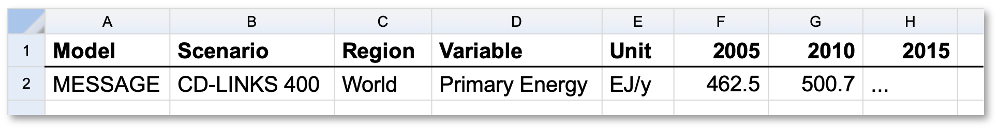

The **ixmp4** Data Model
========================

The **ixmp4** package is a data warehouse for scenario data related to numerical modeling
of climate policy, energy systems transition and sustainable development.

This page is based on the section "The pyam data model" :cite:p:`Huppmann:2021:pyam-v1.0`.

A Scenario Run
--------------

An ixmp4 database contains data for "scenario runs", which can be one of the following:

- Input data and quantitative results of an integrated assessment, a macro-energy
  or an energy systems model (often called a *scenario* for simplicity).
- Input data and quantitative results of a (simple) climate model.
- (Processed) data from a reference source or statistics database,
  e.g., IEA World Energy Statistics and Balances.
- Aggregate indicators or timeseries data generated from several runs
  (e.g. multi-model mean for a specific scenario protocol).

A scenario run is identified by the following *index* attributes:

- *model* name
- *scenario* name, e.g., indicating a "scenario protocol"
- *version* number to distinguish several implementations of a scenario protocol
- a *run-id* for unique identification in the database

A scenario run can have the data types shown below.

The IAMC Timeseries Data Format
-------------------------------

The Integrated Assessment Modeling Consortium (`IAMC <http://iamconsortium.org/>`_)
developed a standardised tabular timeseries format to exchange scenario data
related to energy systems modelling, land-use change, demand sectors,
and economic indicators in the context of the Sustainable Development Goals.
Previous high-level use cases include reports by the *Intergovernmental Panel
on Climate Change* (`IPCC`_) and model comparison exercises
within the *Energy Modeling Forum* (`EMF`_) hosted by Stanford University.

The table below shows a typical example of integrated-assessment scenario data
following the IAMC format from the Horizon 2020 `CD-LINKS`_ project.

   Illustrative example of IAMC-format timeseries data
   via the `IAMC 1.5°C Scenario Explorer`_ (:cite:p:`Huppmann:2019:scenario-data`)

.. _`IAMC 1.5°C Scenario Explorer`: https://data.ece.iiasa.ac.at/iamc-1.5c-explorer

.. _`IPCC`: https://www.ipcc.ch

.. _`EMF`: https://emf.stanford.edu

.. _`CD-LINKS`: https://www.cd-links.org

Supported Time Domains
^^^^^^^^^^^^^^^^^^^^^^

The implementation of the IAMC-format timeseries data format in **ixmp4** supports
three temporal domains:

- **Yearly data**: time domain represented as integer values

- **Continuous-time subannual data**: using the :class:`datetime.datetime` format

- **Categorical sub-annual timeslices**: using a combination of yearly data (as integer)
  and a "category" value (as string), e.g., "peak-demand", "winter-night"

A **run** can simultaneously have timeseries data for all temporal domains.

.. note::

   | The **iamc** data type is closely related to the **data** attribute
     of a :class:`pyam.IamDataFrame`.
   | Read the docs for the `pyam 'data' data model <https://pyam-iamc.readthedocs.io/en/stable/data.html#scenario-timeseries-data-data>`_.

Meta Indicators
---------------

Meta indicators are intended for categorisation and quantitative indicators
for each **run**. Common use cases are the warming category of a scenario
('Below 1.5°C', '1.5°C with low overshoot', etc.) and the cumulative
CO2 emissions until the end of the century.

The meta indicators can be interpreted as a tabular structure

+---------+-------------------+-----------------------------+
| run-id  | key               | value                       |
+=========+===================+=============================+
| 1       | warming-category  | "1.5°C with low overshoot"  |
+---------+-------------------+-----------------------------+

Alternatively, the indicators can be interpreted as a nested dictionary such as

.. code-block:: python

   {
     1: {
       warming-category: "1.5°C with low overshoot",
       ..
     }
   }

.. note::

   | The **meta** data type is closely related to the **meta** attribute
     of a :class:`pyam.IamDataFrame`.
   | Read the docs for the `pyam 'meta' data model <https://pyam-iamc.readthedocs.io/en/stable/data.html#quantitative-and-qualitative-indicators-of-scenarios-meta>`_...
