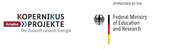

The ixmp4 package for scenario data management
==============================================

Copyright © 2023-2024 IIASA - Energy, Climate, and Environment Program (ECE)

|license| |ruff| |python|

.. |license| image:: https://img.shields.io/badge/license-MIT-brightgreen
   :target: https://github.com/iiasa/ixmp4/blob/main/LICENSE

.. |ruff| image:: https://img.shields.io/endpoint?url=https://raw.githubusercontent.com/charliermarsh/ruff/main/assets/badge/v2.json
   :target: https://github.com/astral-sh/ruff

.. |python| image:: https://img.shields.io/badge/python-3.10_|_3.11_|_3.12-blue?logo=python&logoColor=white
   :target: https://github.com/iiasa/ixmp4

Overview
--------

The **ixmp4** package is a data warehouse for high-powered scenario analysis
in the domain of integrated assessment of climate change and energy systems modeling.

Getting started
---------------

.. toctree::
   :caption: Getting started
   :hidden:
   :maxdepth: 2

   installation
   configuration
   data-model

Core API
--------

.. toctree::
   :caption: Core API
   :hidden:
   :maxdepth: 1

   ixmp4.cli
   ixmp4.conf

   ixmp4.core/platform
   ixmp4.core/run
   ixmp4.core/region
   ixmp4.core/unit
   ixmp4.core/model
   ixmp4.core/scenario
   ixmp4.core/meta

   ixmp4.core/iamc

   ixmp4.core/exceptions

Development
-----------

.. toctree::
   :caption: Development
   :hidden:
   :maxdepth: 1
   
   structure-architecture
   ixmp4.data/modules
   ixmp4.server/modules
   ixmp4.db
   tests

Reference
---------

.. toctree::
   :caption: Reference
   :hidden:
   :maxdepth: 1

   references
   license

   
License
-------

The **ixmp4** package is released under the `MIT License`_.

.. _`MIT License`: https://github.com/iiasa/ixmp4/blob/main/LICENSE

Funding acknowledgement
-----------------------

The development of the **ixmp4** package was funded from the EU Horizon 2020 projects
`openENTRANCE <https://openentrance.eu>`_ and `ECEMF <https://ecemf.eu>`_
as well as the BMBF Kopernikus project `ARIADNE <https://ariadneprojekt.de>`_ |br|
(FKZ 03SFK5A by the German Federal Ministry of Education and Research).

This project has received funding from the European Union’s Horizon 2020
research and innovation programme under grant agreement No. 835896 and 101022622.