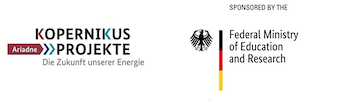

The ixmp4 package for scenario data management
==============================================

Copyright © 2023 IIASA - Energy, Climate, and Environment Program (ECE)

|license| |black| |python|

.. |license| image:: https://img.shields.io/badge/license-MIT-brightgreen
   :target: https://github.com/iiasa/ixmp4/blob/main/LICENSE

.. |black| image:: https://img.shields.io/badge/code%20style-black-000000.svg
   :target: https://github.com/psf/black

.. |python| image:: https://img.shields.io/badge/python-3.10-blue?logo=python&logoColor=white
   :target: https://github.com/iiasa/ixmp4

Overview
--------

The **ixmp4** package is a data warehouse for high-powered scenario analysis
in the domain of integrated assessment of climate change and energy systems modeling.

Table of Contents
-----------------

.. toctree::
   :maxdepth: 1

   configuration
   data-model
   devs/modules
   references

License
-------

The **ixmp4** package is released under the `MIT License`_.

.. _`MIT License`: https://github.com/iiasa/ixmp4/blob/main/LICENSE

Funding acknowledgement
-----------------------

.. figure:: _static/openENTRANCE-logo.png
   :align: left
   :height: 80px

The development of the **ixmp4** package was funded from the EU Horizon 2020 projects
`openENTRANCE <https://openentrance.eu>`_ and `ECEMF <https://ecemf.eu>`_
as well as the BMBF Kopernikus project `ARIADNE <https://ariadneprojekt.de>`_
(FKZ 03SFK5A by the German Federal Ministry of Education and Research).

.. figure:: _static/EU-logo-300x201.jpg
   :align: left
   :width: 80px

This project has received funding from the European Union’s Horizon 2020
research and innovation programme under grant agreement No. 835896 and 101022622.